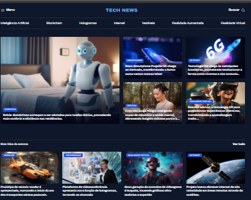

# 🌐 TECH NEWS - Portal de Notícias de Tecnologia

Bem-vindo ao **TECH NEWS**, um portal moderno e responsivo dedicado às últimas novidades do mundo da tecnologia. Com uma interface dinâmica e seções bem organizadas, oferecemos uma experiência completa para os amantes de tecnologia.

## Preview

## 📌 Funcionalidades

- Layout moderno com visual escuro para leitura confortável.
- Destaques em categorias relevantes como Inteligência Artificial, Metaverso, Internet e muito mais.
- Artigos organizados por seções:
  - **Últimas da Semana**
  - **Destaques em Inteligência Artificial**
  - **Tecnologia e Inovação**
- Imagens ilustrativas e chamadas atrativas para engajar o leitor.
- Suporte a multimídia para artigos com vídeos, imagens e links externos.
- Mecanismo de busca no topo para facilitar a navegação.
- Logotipo institucional da UNICRUZ, sugerindo parceria ou produção acadêmica.

